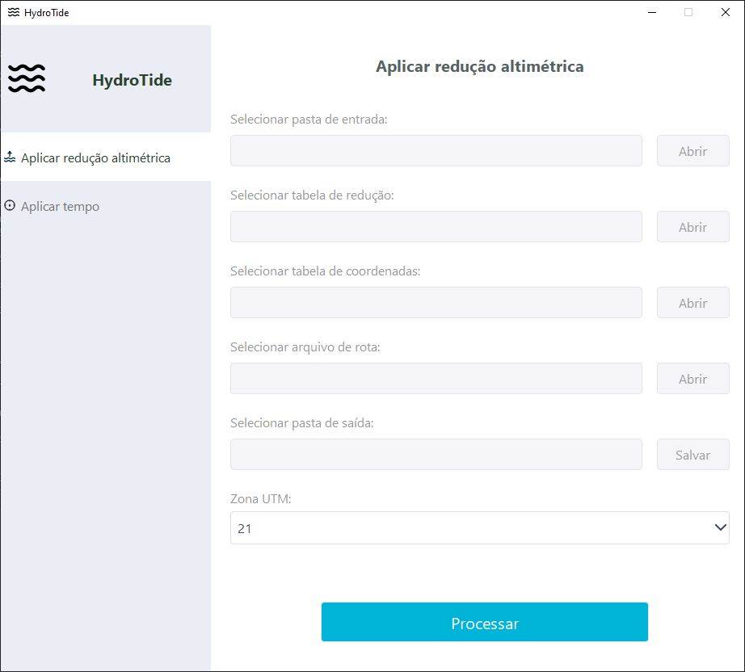
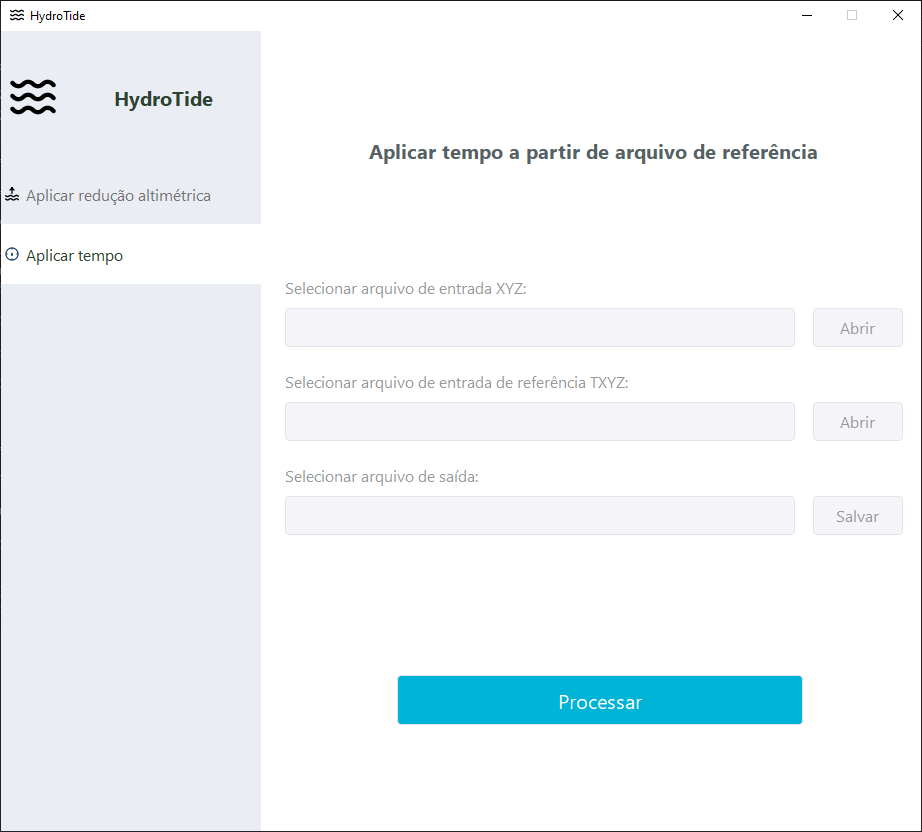

# HydroTide

O software **HydroTide** destina-se à aplicação de redução batimétrica em dados
de ecobatímetro de feixe único (SBES) e multifeixe (MBES), além de adicionar
informações temporais a dados processados, utilizando como referência os dados
brutos. Os dados são estruturados no formato `txyz`, permitindo a localização
temporal e espacial de cada amostra.

## Pré-requisitos

Para utilizar o software, é necessária a instalação do
**[Python 3.12](https://www.python.org/ftp/python/3.12.10/python-3.12.10-amd64.exe)**.

## Download

A última versão do software pode ser baixada no Google Drive:
[hydro-tide v1.0](https://drive.google.com/file/d/1ZnfUA0cbnNXCv68eVAwzIuZGA6A57MSH/view?usp=drive_link).

---

## Ajuste de Altimetria



### Entradas

- **Pasta de entrada**: Diretório contendo os arquivos de dados `txyz`, com
  extensão `.txt` ou `.xyz`.
- **Tabela de redução**: Arquivo `.xlsx` com as reduções das estações
  fluviométricas, contendo colunas para `data`, `hora` e uma coluna por
  estação.
- **Tabela de coordenadas**: Arquivo `.xlsx` com as coordenadas UTM de cada
  estação, contendo as colunas `estacao`, `x` e `y`.
- **Arquivo de rota**: Arquivo de trajeto do rio nos formatos `.kml`, `.kmz` ou
  `.shp`.
- **Pasta de saída**: Diretório onde serão salvos os resultados do
  processamento.
- **Zona UTM**: Zona UTM no datum **SIRGAS2000** utilizada para o
  processamento.

### Formato dos Dados de Entrada

#### Arquivo de Entrada (txyz)

Os arquivos devem seguir o padrão `txyz` com valores separados por vírgula:

```csv
2025-09-08 07:44:49.80,698364.419,9631317.182,-5.46
2025-09-08 07:44:50.60,698364.622,9631306.514,-5.47
2025-09-08 07:44:51.40,698364.744,9631295.932,-5.37
2025-09-08 07:44:52.20,698364.881,9631285.265,-5.33
2025-09-08 07:44:53.00,698364.957,9631274.523,-5.32
```

#### Tabela de Redução

Exemplo de estrutura da tabela de redução:

|   data   | hora | itaituba | santarem |
| :------: | :--: | :------: | :------: |
| 01/08/25 | 0:00 |   0.78   |   4.40   |
| 01/08/25 | 0:15 |   0.78   |   4.40   |
| 01/08/25 | 0:30 |   0.76   |   4.38   |
| 01/08/25 | 0:45 |   0.76   |   4.38   |

#### Tabela de Coordenadas

Exemplo de estrutura da tabela de coordenadas:

| estacao  |   x    |    y    |
| :------: | :----: | :-----: |
| itaituba | 612996 | 9527266 |
| santarem | 749244 | 9732981 |

### Saídas

- **Arquivo reduzido**: Para cada arquivo de entrada, é gerado um arquivo com
  extensão `.xyz`, contendo o valor de profundidade ajustado.
- **Tabela de parâmetros de redução**: Arquivo `.csv` detalhando os parâmetros
  utilizados na redução para cada ponto processado.

#### Arquivo Reduzido

Exemplo de saída após o processamento:

```csv
2025-09-08 07:44:49.80,698364.419,9631317.182,-4.10
2025-09-08 07:44:50.60,698364.622,9631306.514,-4.11
2025-09-08 07:44:51.40,698364.744,9631295.932,-4.01
2025-09-08 07:44:52.20,698364.881,9631285.265,-3.97
2025-09-08 07:44:53.00,698364.957,9631274.523,-3.96
```

#### Tabela de Parâmetros de Redução

Exemplo da tabela gerada:

| Tempo                  | Este [m]  | Norte [m]  | Altimetria original [m] | Redução aplicada [m] | Altimetria reduzida [m] | Distância [m] | Timestamp  |
| ---------------------- | --------- | ---------- | ----------------------- | -------------------- | ----------------------- | ------------- | ---------- |
| 2025-09-08 07:44:49.80 | 698364.42 | 9631317.18 | -5.46                   | 1.36                 | -4.10                   | 141761.64     | 1757328289 |
| 2025-09-08 07:44:50.60 | 698364.62 | 9631306.51 | -5.47                   | 1.36                 | -4.11                   | 141751.45     | 1757328290 |
| 2025-09-08 07:44:51.40 | 698364.74 | 9631295.93 | -5.37                   | 1.36                 | -4.01                   | 141741.31     | 1757328291 |
| 2025-09-08 07:44:52.20 | 698364.88 | 9631285.27 | -5.33                   | 1.36                 | -3.97                   | 141731.10     | 1757328292 |
| 2025-09-08 07:44:53.00 | 698364.96 | 9631274.52 | -5.32                   | 1.36                 | -3.96                   | 141720.80     | 1757328293 |

---

## Metodologia

O processamento de ajuste de altimetria no **HydroTide** segue as seguintes
etapas:

1. **Leitura dos dados de entrada**: Os arquivos no formato `txyz` são lidos e
   validações iniciais são realizadas.
1. **Análise das tabelas auxiliares**: As tabelas de redução e de coordenadas
   são verificadas e preparadas.
1. **Posicionamento das estações**: Com base no arquivo de rota e na tabela de
   coordenadas, determina-se a posição relativa de cada estação fluviométrica
   ao longo do trajeto do rio.
1. **Criação da função de interpolação**: Uma função de interpolação
   $$f(x, t)$$ é gerada, onde:
   - $$x$$ representa a posição do ponto em relação à rota.
   - $$t$$ representa o tempo.
   - O resultado da função é o **valor de redução** (em metros) a ser aplicado
     no ponto.
1. **Processamento dos pontos**: Para cada ponto do arquivo de entrada:
   - Calcula-se sua posição relativa ao longo da rota.
   - Aplica-se a função de interpolação para obter o valor de redução
     correspondente.
   - O valor de profundidade é ajustado e os resultados são escritos nos
     arquivos de saída, juntamente com os metadados do processamento.

Esta abordagem permite uma **redução batimétrica espacial e temporalmente
precisa**, adequando-se às variações do nível d’água ao longo do rio e do tempo
de coleta dos dados.

---

## Ajuste de tempo



### Entradas

- **Arquivo de entrada XYZ**: Arquivo de entrada no formato `xyz` em que se
  deseja adicionar a informação de tempo.
- **Arquivo de entrada de referência TXYZ**: Arquivo de entrada no formato
  `txyz` de onde será extraída a informação de tempo.
- **Arquivo de saída**: Arquivo contendo os dados do arquivo de entrada
  adicionado do tempo.

### Metodologia

O processamento de ajuste de tempo no **HydroTide** segue as seguintes etapas:

1. **Leitura dos dados de entrada**: Os arquivos `xyz` e `txyz` são lidos;
1. **Geração de correspondência espacial**: Os pontos de cada arquivo são
   correspondidos utilizando as coordenadas $$x$$ e $$y$$ de cada ponto.
1. **Geração de correspondência temporal**: As informações de tempo são
   copiadas entre os pontos que tiveram correspondência espacial, sendo
   escritos no arquivo de saída.
