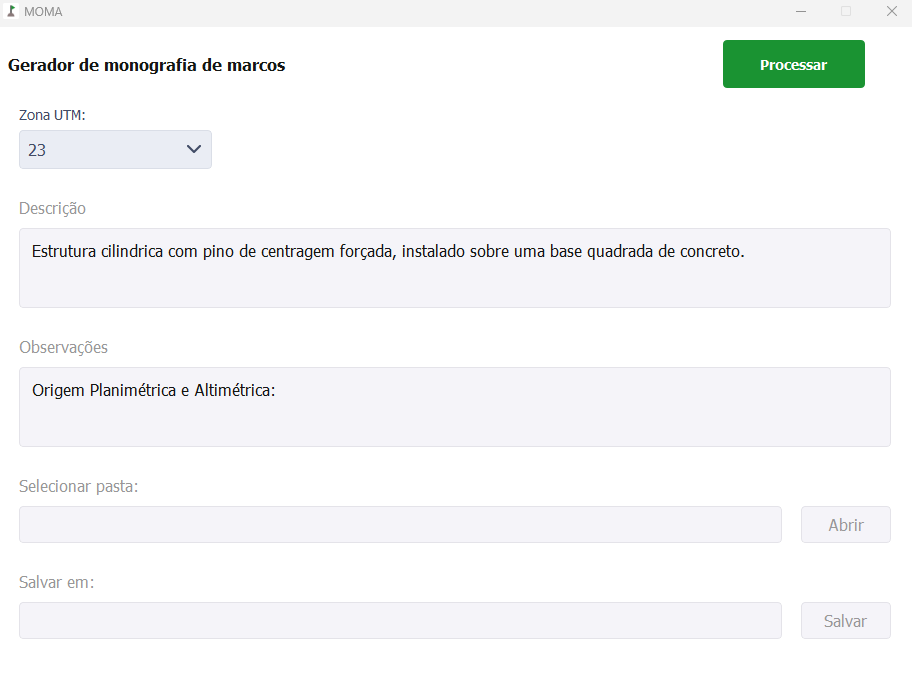
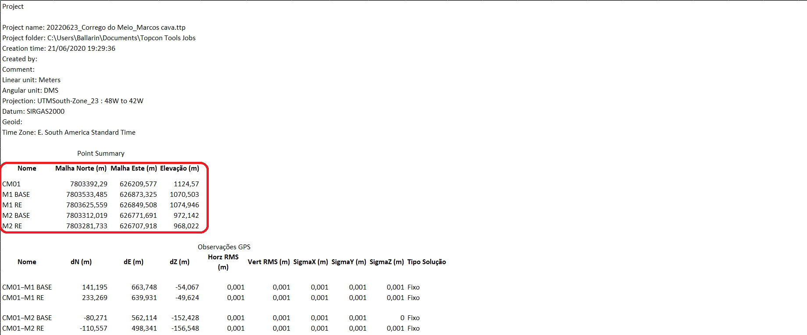
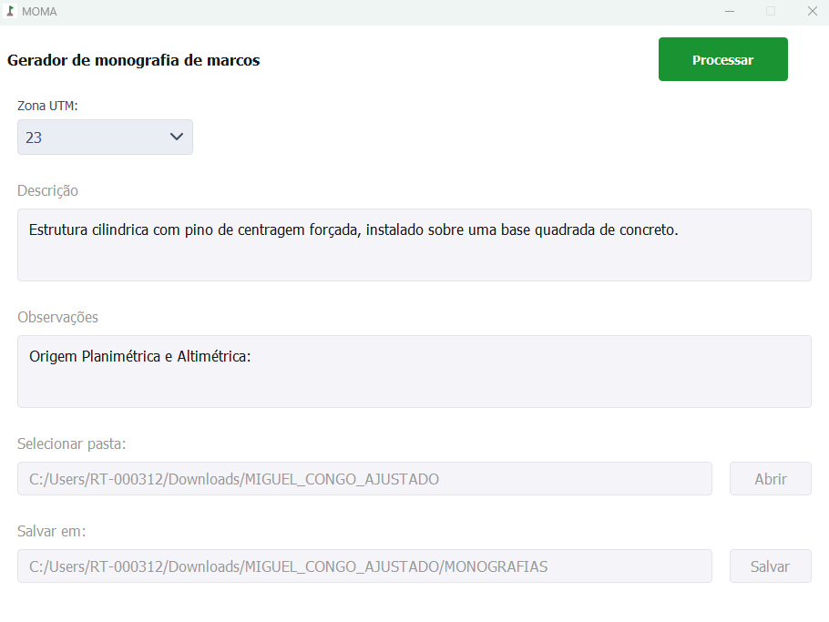
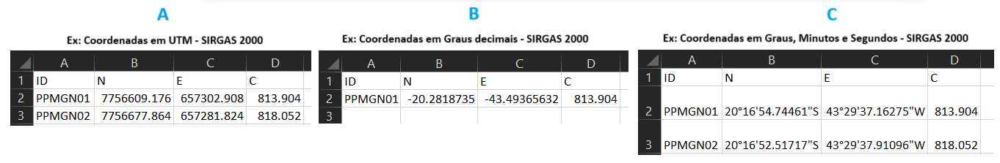
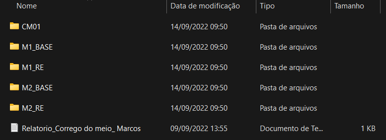
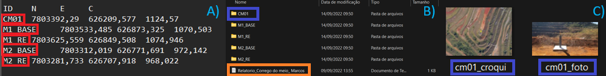
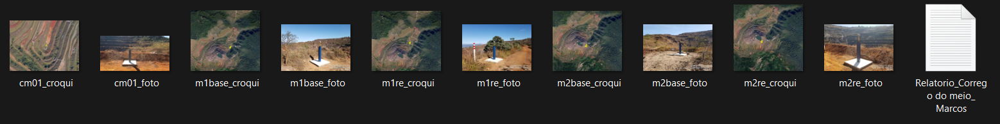
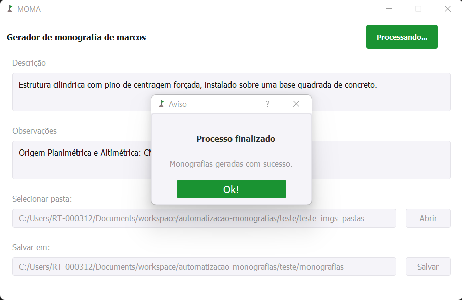

# MOMA

O software foi desenvolvido visando gerar monografias dos marcos. O usuário
seleciona uma pasta contendo as pastas de cada marco com suas respectivas
imagens de croqui e foto e, um arquivo Excel (`xlsx`) com as informações
referentes a cada marco. A tabela Excel de entrada com as coordenas, podem ser
em UTM, Graus, Minutos e Segundos ou Graus decimais (essas coordenas devem
estar em SIRGAS 2000). O programa lê essas informações, converte as coordenadas
de SIRGAS 2000 para SAD69 e preenche um template com essas informações e com a
foto e croqui referente a cada marco. Na figura 1 é mostrado a tela principal
do Software.

## Download

A última versão do software pode ser baixada no Google Drive:
[moma_v2.5](https://drive.google.com/file/d/1vXCsi1CBup2U9_fD7IEgPyWA7Kl1ImRn/view?usp=drive_link).

---

## Automatizar monografias

 Figura 1: Tela principal. 

### Exemplo de uso:

#### Passo 1:

Nos campos de "Descrição" e "Observações", encontra-se um texto default (como
visto na Figura 1) e o usuário pode editar conforme o marco da região (Figura
3). Feito isso, o usuário seleciona a pasta contendo as imagens e o arquivo
Excel (xlsx) e em seguida seleciona pasta que serão salvas as monografias. O
usuário normalmente recebe uma tabela Excel com as informações de cada marco
(como mostrado na Figura 2). A partir dessa tabela, o usuário pega as
informações dos marcos (selecionado de vermelho, como é mostrado na Figura 2) e
cria um arquivo Excel (Figura 4).

 Figura 2: Dados da Planilha Excel. 

 Figura 3: Campos preenchidos. 

 Figura 4: Estrutura do arquivo Excel (xlsx). As coordenas podem ser em UTM (Figura A), Graus, Minutos e Segundos (Figura C) ou Graus decimais (Figura B). Essas coordenas de entrada devem estar em SIRGAS 2000. 

- **Selecionar pasta**: Nesse campo, o usuário seleciona a estrutura de pasta
  que achar melhor, contendo as imagens e o arquivo Excel (como mostrado nas
  Figuras 5 e 7). O usuário tem duas formas de montar a pasta contendo as
  imagens e o arquivo Excel. A primeira forma (Figuras 5 e 6), o usuário cria
  subpastas para cada marco (Figura 6).

 Figura 5: Primeira estrutura de pasta. 

Nessa primeira forma de criar a pasta, o nome das subpastas devem ser os mesmos
que se encontram no arquivo Excel (conforme mostrado na Figura 6A e 6B) e
dentro de cada subpastas, as imagens devem ser nomeadas exatamente como é
mostrado na Figura 6C (o nome dos marcos que aparecem nas imagens são os nomes
que o usuário recebe na tabela Excel.). O arquivo Excel pode ficar fora das
subpastas (Figura 6B, arquivo marcado de laranja).

 Figura 6: Como montar as subpastas e nomear as imagens. 

Já para a segunda estrutura, o usuário pode deixar o arquivo Excel e as imagens
soltas em uma pasta, porém as imagens devem ser nomeadas conforme é mostrada na
Figura 7. O nome dos marcos que aparecem nas imagens são os nomes que o usuário
recebe na tabela Excel.

 Figura 7: Segunda estrutura de pasta com a nomenclatura das imagens. 

{: .note }

> Caso se deseje uma logo diferente da logo padrão (Vale), pode-se adicionar
> uma imagem com o nome `logo` juntamente com os outros arquivos.

- **Salvar em**: Nesse campo, o usuário seleciona a pasta para salvar as
  monografias que serão geradas. É recomendado que seja criado uma pasta apenas
  para salvar as monografias (Figura 8).

 Figura 8: Pasta para salvar as monografias. 

#### Passo 2:

Feito isso, basta o usuário clicar no botão "Processar" e aguardar a geração
das monografias, quando o processo finalizar, uma mensagem aparecerá (Figura
9).

 Figura 9: Mensagem informando o fim do processo. 

