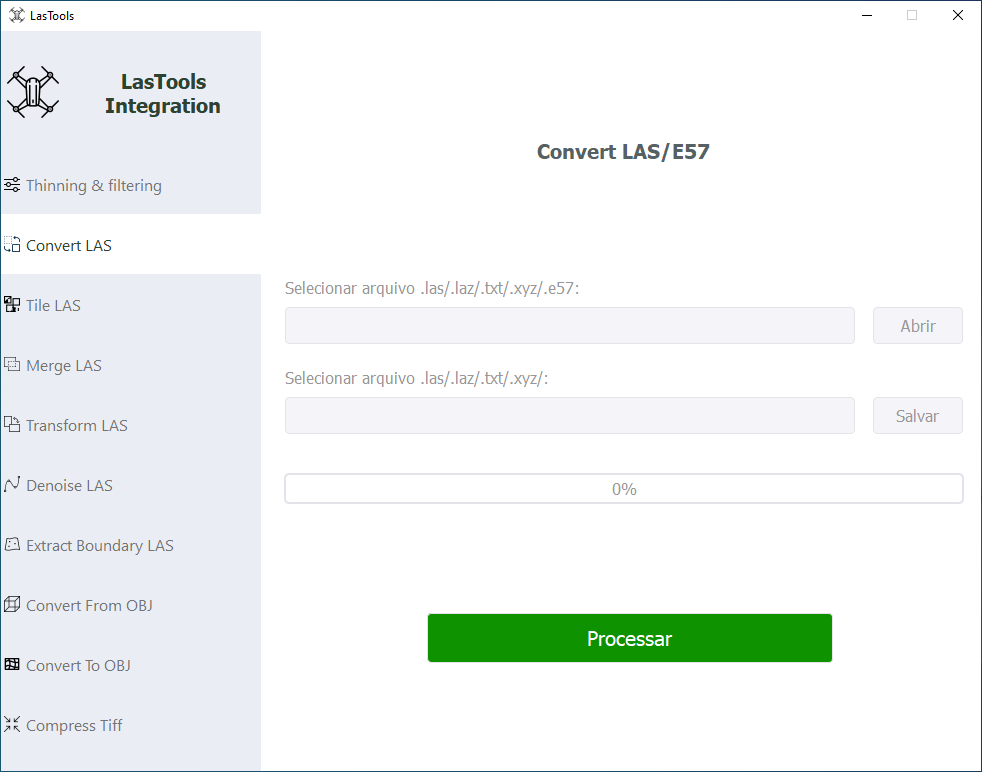

# Formato `.laz`

Tanto o formato `.las` como o formato `.laz` são formatos de arquivos de pontos
3D binários e de código aberto. A diferença entre eles é que o segundo é a
versão compactada do primeiro, possuindo um tamanho em torno de 7~20% do
original [^laz_git]. O formato `.laz` utiliza a versão mais recente do formato
`.las` (1.4) [^laz_specification] e é considerado pela OGC (_Open Geospatial
Consortium_) como o padrão industrial para dados comprimidos de LiDAR
[^laz_standard].

O formato `.las` possui uma _header_, com tamanho de 375 bytes na versão mais
recente (1.4), contendo informações de metadados, como por exemplo:
identificação, versão, formato de dados, fatores de escala e _offsets_ e
_bounding box_ [^las_specification]. Também é possível o armazenamento de
outras informações, como o sistemas de coordenadas, em campos de VLR (_Variable
Length Record_).

As informações de posição são armazenadas como inteiros sem sinal de 32 bits,
devem ser aplicados os valores de escala e _offsets_ para obter o valor real
[^las_specification], na forma:

$$
\begin{aligned}
X_{\text{coordinate}} &= (X_{\text{record}} \times X_{\text{scale}}) + X_{\text{offset}} \\
Y_{\text{coordinate}} &= (Y_{\text{record}} \times Y_{\text{scale}}) + Y_{\text{offset}} \\
Z_{\text{coordinate}} &= (Z_{\text{record}} \times Z_{\text{scale}}) + Z_{\text{offset}}
\end{aligned}
$$

Para a compressão e decompressão de arquivos no formato `.laz`, o software
`Lastools Integration` pode ser utilizado:

[^laz_git]: https://github.com/LASzip/LASzip

[^laz_specification]:
    https://downloads.rapidlasso.de/doc/LAZ_Specification_1.4_R0.pdf

[^laz_standard]:
    https://www.ogc.org/requests/laz-v1-4-community-standard-work-item-proposal/

[^las_specification]:
    https://www.asprs.org/wp-content/uploads/2019/07/LAS_1_4_r15.pdf
